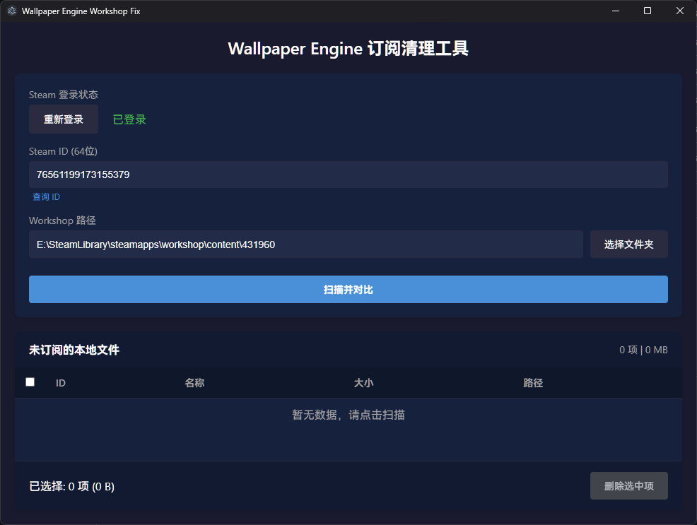

# Wallpaper Engine Workshop Fix Tool

一个轻量级的工具，用于清理 Wallpaper Engine 本地残留的未订阅 Workshop 物品。

> 🤖 **Note**: 本项目核心代码由 Google DeepMind 的 **Gemini 3 Pro** 模型辅助编写。



## ⚠️ 温馨提示 (Security Warning)

**账号安全至关重要！**

请千万不要在任何来源不明、未开源或未经验证的第三方程序中输入您的 Steam 账号密码，以免遭遇盗号风险。

*   本工具已完全**开源**，您可以随时审查源代码。
*   本工具的登录操作均在本地的 Electron 安全窗口（BrowserWindow）中进行，直接与 Steam 官方服务器通信。
*   本工具**绝不会**收集、上传或转发您的账号、密码或 Cookie 到任何第三方服务器。

建议您仅从 GitHub 的 Releases 页面下载作者发布的版本，或自行下载源码编译使用。

## 🌟 功能特点

*   **智能对比**：自动获取您的 Steam 订阅列表，并与本地文件进行对比。
*   **无需 API Key**：内置 Steam 登录功能，直接通过安全窗口登录，无需繁琐申请 Web API Key。
*   **隐私安全**：登录过程在本地完成，Cookie 仅用于获取订阅列表，不会上传到任何服务器。
*   **一键清理**：直观展示未订阅的残留文件，支持批量删除，释放磁盘空间。
*   **轻量级**：基于 Electron 构建，体积小巧，界面简洁。

## 🚀 使用指南

1.  **启动应用**。
2.  **登录 Steam**：点击界面上的“登录 Steam”按钮，在弹出的窗口中登录您的账号。
    *   *注意：这是为了获取您的订阅列表，登录状态仅保存在本地会话中。*
3.  **设置路径**：
    *   **Steam ID**：输入您的 64 位 Steam ID（通常登录后会自动识别，如未识别请手动输入）。
    *   **Workshop 路径**：选择 Wallpaper Engine 的下载目录，通常位于 `Steam\steamapps\workshop\content\431960`。
4.  **扫描**：点击“扫描并对比”按钮。
5.  **清理**：勾选列表中检测到的未订阅项目，点击“删除选中项”即可。

## 🛠️ 开发与构建

### 前置要求

*   [Node.js](https://nodejs.org/) (建议 v14+)
*   npm (随 Node.js 安装)

### 安装依赖

```bash
npm install
```

### 本地运行

```bash
npm start
```

### 打包构建 (Windows)

构建生成的安装包将位于 `dist` 目录下。

```bash
npm run build
```

## 📝 技术栈

*   **Electron**: 跨平台桌面应用框架
*   **Vanilla JS/HTML/CSS**: 原生前端技术，保持轻量
*   **Electron Store**: 本地配置存储
*   **Electron Builder**: 应用打包工具

## ⚠️ 免责声明

本工具仅用于辅助管理本地文件，删除操作不可恢复，请在删除前仔细核对。作者不对因使用本工具导致的文件丢失或损坏承担责任。

## 📄 License

Distributed under the MIT License. See `LICENSE` for more information.
